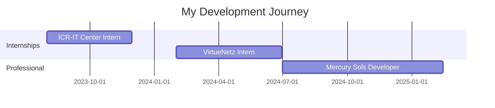

<div align="center">

<!-- Animated Header -->


<!-- Typing Animation -->


<br/>

<!-- Social badges with animation -->
[](https://linkedin.com/in/Muhammad-Hanzla)
[](https://github.com/itshanzla)
[](mailto:hanzlamohammad8@gmail.com)

<br/>

</div>

---


## 🙋‍♂️ About Me

```typescript
const developer = {
  name: "Muhammad Hanzla",
  location: "📍 Lahore, Pakistan",
  role: "React Native Developer @ Mercury Sols",
  
  currentFocus: [
    "Building scalable mobile apps",
    "Exploring system design patterns",
    "Contributing to open source"
  ],
  
  experience: {
    mobile: ["React Native", "Expo", "Flutter"],
    backend: ["Node.js", "Express", "Go", "Python"],
    cloud: ["AWS", "DigitalOcean", "Cloudflare Workers"],
    architecture: ["Microservices", "Serverless", "Blockchain"]
  },
  
  funFact: "I debug with console.log and I'm not ashamed 😄"
};
```


### What I'm Up To

- 🔭 Working on AI-powered mobile & web applications
- 🌱 Learning about blockchain integration & system design
- 👯 Open to collaborating on React Native & web projects
- 💬 Ask me about mobile development, web apps & cloud architecture
- 📫 Reach me at: hanzlamohammad8@gmail.com
- ⚡ Fun fact: Started with Flutter, fell in love with React Native

<br clear="both"/>

---

## 🛠️ Tech Arsenal

<div align="center">

### Mobile Development


### Frontend & Web


### Backend & Languages


### Database & Storage


### Cloud & DevOps


### Tools & More


</div>

---

## 🚀 Project Portfolio

<div align="center">

### 🤖 AI & Machine Learning

<table>
  <tr>
    <td width="50%">
      <h3 align="center">🧠 Second Brain</h3>
      <div align="center">  
        
        <br/><br/>
        <p><strong>AI Memory Mobile App</strong></p>
        <p>Python • Expo • AI Integration</p>
      </div>
    </td>
    <td width="50%">
      <h3 align="center">🤝 UnifAI</h3>
      <div align="center">
        
        <br/><br/>
        <p><strong>AI-Powered Couples App</strong></p>
        <p>React Native • AI Features</p>
      </div>
    </td>
  </tr>
  <tr>
    <td width="50%">
      <h3 align="center">📧 Smart Reply System</h3>
      <div align="center">
        
        <br/><br/>
        <p><strong>Email Automation</strong></p>
        <p>Auto-reply • Priority Management</p>
      </div>
    </td>
    <td width="50%">
      <h3 align="center">👥 Member AI</h3>
      <div align="center">
        
        <br/><br/>
        <p><strong>Complete SaaS Platform</strong></p>
        <p>AI-Powered • Full Stack</p>
      </div>
    </td>
  </tr>
</table>

### 🏢 Enterprise & SaaS

<table>
  <tr>
    <td width="50%">
      <h3 align="center">☁️ Airbin</h3>
      <div align="center">
        
        <br/><br/>
        <p><strong>US-Based Startup</strong></p>
        <p>AI • Cloud Storage Platform</p>
      </div>
    </td>
    <td width="50%">
      <h3 align="center">🌍 Simwise</h3>
      <div align="center">
        
        <br/><br/>
        <p><strong>eSIM Platform</strong></p>
        <p>Expo • Express • Go • Microservices • 180 Countries</p>
      </div>
    </td>
  </tr>
  <tr>
    <td width="50%">
      <h3 align="center">☕ NINA SaaS</h3>
      <div align="center">
        
        <br/><br/>
        <p><strong>Business Management</strong></p>
        <p>Coffee • Bakery • Multi-tenant SaaS</p>
      </div>
    </td>
    <td width="50%">
    </td>
  </tr>
</table>

### 🏥 Healthcare & Wellness

<table>
  <tr>
    <td width="50%">
      <h3 align="center">🌿 IBOGA</h3>
      <div align="center">
        
        <br/><br/>
        <p><strong>Retreats Platform</strong></p>
        <p>Creation • Booking • Wellness</p>
      </div>
    </td>
    <td width="50%">
      <h3 align="center">🧘 EveryKid</h3>
      <div align="center">
        
        <br/><br/>
        <p><strong>Wellness App</strong></p>
        <p>Child Health • Mobile Platform</p>
      </div>
    </td>
  </tr>
  <tr>
    <td width="50%">
      <h3 align="center">💪 uroFitness</h3>
      <div align="center">
        
        <br/><br/>
        <p><strong>Men's Health App</strong></p>
        <p>Wellness • Fitness Tracking</p>
      </div>
    </td>
    <td width="50%">
      <h3 align="center">🏥 Humacare Medical</h3>
      <div align="center">
        
        <br/><br/>
        <p><strong>Healthcare System</strong></p>
        <p>Encrypted Records • Automated Reporting</p>
      </div>
    </td>
  </tr>
  <tr>
    <td width="50%">
      <h3 align="center">👨‍⚕️ Telemedicine Platform</h3>
      <div align="center">
        
        <br/><br/>
        <p><strong>Video Consultation</strong></p>
        <p>2,000+ Users • AI Chatbot • Agora SDK</p>
      </div>
    </td>
    <td width="50%">
    </td>
  </tr>
</table>

### 🎓 Education & Productivity

<table>
  <tr>
    <td width="50%">
      <h3 align="center">📚 Alaziz Education</h3>
      <div align="center">
        
        <br/><br/>
        <p><strong>Learning Management</strong></p>
        <p>Real-time Analytics • 500+ Students</p>
      </div>
    </td>
    <td width="50%">
      <h3 align="center">✅ NowYou</h3>
      <div align="center">
        
        <br/><br/>
        <p><strong>Task Management</strong></p>
        <p>React Native • Entirely Offline • Intuitive</p>
      </div>
    </td>
  </tr>
  <tr>
    <td width="50%">
      <h3 align="center">👨‍🏫 Behavior Management</h3>
      <div align="center">
        
        <br/><br/>
        <p><strong>Educational App</strong></p>
        <p>Teachers • Students • Behavior Tracking</p>
      </div>
    </td>
    <td width="50%">
    </td>
  </tr>
</table>

### 🏨 Hospitality & Travel

<table>
  <tr>
    <td width="50%">
      <h3 align="center">🏖️ Havnova</h3>
      <div align="center">
        
        <br/><br/>
        <p><strong>Cuba Airbnb Platform</strong></p>
        <p>Booking • Property Management</p>
      </div>
    </td>
    <td width="50%">
    </td>
  </tr>
</table>

### 🎵 Social & Entertainment

<table>
  <tr>
    <td width="50%">
      <h3 align="center">🎶 Vibeshare</h3>
      <div align="center">
        
        <br/><br/>
        <p><strong>Music Platform</strong></p>
        <p>Spotify API • Real-time Collaboration</p>
      </div>
    </td>
    <td width="50%">
      <h3 align="center">📖 Quran App</h3>
      <div align="center">
        
        <br/><br/>
        <p><strong>Islamic Application</strong></p>
        <p>Flutter • Mushaf • Translation • Audio • Tasbeeh</p>
      </div>
    </td>
  </tr>
</table>

### 🌐 Web Applications

<table>
  <tr>
    <td width="50%">
      <h3 align="center">🎵 ORIA</h3>
      <div align="center">
        
        <br/><br/>
        <p><strong>Music NFT Platform</strong></p>
        <p>PWA • Nexus Blockchain • Custom Server Integration</p>
      </div>
    </td>
    <td width="50%">
      <h3 align="center">📄 EFactura Romania</h3>
      <div align="center">
        
        <br/><br/>
        <p><strong>Invoice Management</strong></p>
        <p>Web App • XML Validation • Romanian Platform</p>
      </div>
    </td>
  </tr>
  <tr>
    <td width="50%">
      <h3 align="center">📱 NINA & Dean Coffee</h3>
      <div align="center">
        
        <br/><br/>
        <p><strong>Complete Product Suite</strong></p>
        <p>Website • Admin Panel • Mobile • Backend • London Based</p>
      </div>
    </td>
    <td width="50%">
      <h3 align="center">🎨 ToonPick</h3>
      <div align="center">
        
        <br/><br/>
        <p><strong>Creative Industry Platform</strong></p>
        <p>Web Platform • Korean • Studios • Artists • Hiring</p>
      </div>
    </td>
  </tr>
</table>

### 💼 Business Projects

<table>
  <tr>
    <td width="33%">
      <h3 align="center">🏢 GrupoSavesta</h3>
      <div align="center">
        
        <br/><br/>
        <p>Enterprise Solution</p>
      </div>
    </td>
    <td width="33%">
      <h3 align="center">📝 Screvio</h3>
      <div align="center">
        
        <br/><br/>
        <p>Business Platform</p>
      </div>
    </td>
    <td width="33%">
      <h3 align="center">💰 Earnedit</h3>
      <div align="center">
        
        <br/><br/>
        <p>Financial Tool</p>
      </div>
    </td>
  </tr>
</table>

</div>

---

## 📊 GitHub Journey

<div align="center">


<br/>


<br/>


</div>

---

## 🏆 GitHub Trophies

<div align="center">


</div>

---

## 💼 Experience Timeline



---

## 🎯 This Week's Dev Breakdown

<!--START_SECTION:waka-->
```text
TypeScript   58 hrs 45 mins  ████████████░░░░░   52.3%
JavaScript   28 hrs 30 mins  ██████░░░░░░░░░░░   25.4%
Python       12 hrs 15 mins  ██░░░░░░░░░░░░░░░   10.9%
Go           8 hrs 20 mins   █░░░░░░░░░░░░░░░░    7.4%
JSON         4 hrs 30 mins   █░░░░░░░░░░░░░░░░    4.0%
```
<!--END_SECTION:waka-->

> 💡 Want live stats? Set up [WakaTime](https://github.com/athul/waka-readme) to auto-update this section!

---

## 🌟 Let's Build Something Together!

<div align="center">


### 💡 Open to

✨ Freelance Projects | 🤝 Collaborations | 💼 Remote Opportunities

**Specializing in:** Mobile Development • Web Applications • Cloud Architecture • AI Integration • Blockchain

<br/>

[](https://visitcount.itsvg.in)

</div>

---


